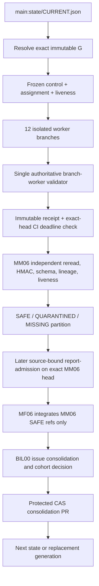

# Project Supernova Protocol 2.5 Workflow and Integration Map

**Status:** prospective authoritative-control documentation for the replacement countable cohort  
**Current authority:** Revision 4 / Protocol 2.5  
**Fresh science:** disabled  
**Revision 5:** candidate only until two consecutive clean countable v2.5 cohorts

## 1. Core invariant

`main:state/CURRENT.json` is the only mutable canonical pointer. Every task first resolves the exact immutable generation head **G**, then reads the control, assignment, liveness, schemas, runtime/substrate identities and role contract frozen by G. Mutable `main` documentation is never scientific authority for an active cohort.

Gen9 remains immutable evidence. Because the defects described in issue #161 require authoritative control changes, Gen9 cannot receive clean-cohort credit after those changes are accepted. The replacement cohort starts at calibration streak 0 with fresh work still disabled.

## 2. End-to-end execution pipeline



### Stage 0 — canonical resolution

Every lane reads only the live main pointer, then resolves G and verifies all frozen identities. A stale SHA, changed state, missing control, wrong token, wrong role, wrong mode or inconsistent countability stops the run.

### Stage 1 — worker fan-out

The twelve worker lanes are isolated:

- Math Foundry: MF01–MF05;
- Mastermind: MM01–MM05 and MM07;
- independent transport: EXT01.

Each worker writes exactly one create-once path:

```text
reports/<cohort>/<role>.json
```

A valid no-finding run writes a typed `ZERO_DELTA` receipt. Missing, late, disconnected or unknown work is never converted to zero evidence.

### Stage 2 — structural and deadline admission

Exactly one workflow may publish success for each shared `supernova/branch-*` context: `.github/workflows/supernova-branch-reconciler.yml`, using `scripts/validate_branch_bus_v252.py`.

The REST path is diagnostic only and writes `supernova/rest-generation-audit`. It cannot overwrite a shared structural verdict.

Liveness is based on immutable evidence, not polling time:

1. exactly one report-path creation commit;
2. report creation no later than the frozen deadline;
3. exact worker-head `supernova/branch-worker=success` from `github-actions[bot]` no later than the deadline.

An on-time report found later still passes. A genuinely late report or late structural validation is `RUN_LATE` and blocks the cohort.

### Stage 3 — MM06 verification

MM06 independently rereads every exact worker branch and proves:

- ancestry from G;
- exactly one assigned report path changed;
- create-once history;
- exact branch-worker status;
- frozen schema and role contract;
- session and execution-mode equality;
- whole-report HMAC-2;
- zero prohibited fresh/private/benchmark cost;
- public safety and honest model binding;
- on-time liveness.

MM06 owns a unique, disjoint and exhaustive `SAFE / QUARANTINED / MISSING` partition. It never integrates its own verdict.

### Stage 4 — post-write report admission

The immutable MM06 receipt can record only pre-CI state. A later trusted workflow must publish source-bound `supernova/report-admission=success` on the exact verifier head. MF06 cannot proceed from a self-attested or pending status.

### Stage 5 — MF06 integration

MF06 consumes only MM06 SAFE references and independently rereads them for transport integrity. It preserves negative results, unknowns, costs, model-binding limitations, verifier dependence and statement-fidelity limitations. It does not re-verify or bypass quarantine.

### Stage 6 — BIL00 issue and repair loop

BIL00 reads worker, MM06, MF06 and A01 issue ledgers, then:

1. deduplicates by stable ID **and exact failure mechanism**;
2. creates or updates a public-safe GitHub issue;
3. classifies it as blocking, immediate repair, deferred, empirical/not-measured or closed-with-evidence;
4. creates the smallest exact-main hardening PR;
5. adds positive, negative and nonvacuity tests;
6. requires read-only Candidate Diagnostics;
7. requires trusted bootstrap for authority-changing bytes;
8. requires all three source-bound main admission contexts;
9. merges without bypass;
10. reruns the original falsifier;
11. closes only with objective evidence.

Two audit/repair passes are the default per eligible director run. Three is the hard maximum only for lightweight deterministic work after a clean prior pass.

### Stage 7 — consolidation and transition

BIL00 may create the protected consolidation PR only after complete verification, later report admission, safe integration and liveness. CAS requires the exact expected main head. Failed or changed authority leaves the streak unchanged.

## 3. Status-context ownership

| Context | Sole success writer | Meaning |
|---|---|---|
| `supernova/branch-generation` | Branch Reconciler | exact immutable generation envelope and frozen control |
| `supernova/branch-worker` | Branch Reconciler | exact worker branch/report structural admission |
| `supernova/branch-verify` | Branch Reconciler | exact MM06 receipt structure |
| `supernova/branch-integrate` | Branch Reconciler | exact MF06 receipt structure |
| `supernova/branch-consolidate` | Branch Reconciler | exact consolidation CAS/diff policy |
| `supernova/liveness` | Receipt Liveness Monitor | immutable on-time report + structural-CI proof |
| `supernova/rest-generation-audit` | REST Audit | diagnostic only; never shared authority |
| `supernova/static-control` | trusted main admission | candidate control validation |
| `supernova/report-admission` | trusted main admission | report/history eligibility |
| `supernova/transition-admission` | trusted main admission | lineage/CAS transition eligibility |

A matching context string from another writer is not authority.

## 4. Typed role integration

The replacement cohort freezes prospective overlay contracts:

- every issue record must include `exact_failure` and an executable `required_test`;
- MM03 has one closed typed missingness payload; sibling shadow metrics are rejected;
- MM07 replay requires explicit NOT_MEASURED/null results, no numeric delta, no next candidate, no self-promotion and no Goal-2 credit;
- MM07 fresh Stage0 work requires a predeclared frozen stop, typed event trace, descriptive-only rho, typed before/after results, frozen scores and at most one bounded next candidate;
- MM01 fresh React proposals are cross-bound to the exact outer assignment, cohort, phase, TRAIN pool, worker fresh permission and private manifest ID/blob;
- fresh reports generally require `FRESH_ENABLED`, frozen worker permission and exact private-manifest identity;
- verifier assurance must contain records or an explicit transport-only not-applicable disposition; scientific verification cannot use that N/A disposition.

The public repository validates opaque identities and ownership. The private vault validates the protected `FROZEN_PRE_OUTCOME` payload. Protected prompts, item IDs and raw secrets never enter the public bus.

## 5. Issue deduplication map for Gen9

The following reports describe common underlying failures and must be consolidated rather than counted independently:

- generation diff/liveness rejection + dual writers → **single structural-authority defect**;
- existing-after-deadline pass → **deadline truth defect**;
- MM07 replay and Stage0 omissions → **mode-discriminated MM07 contract defect**;
- optional `exact_failure` → **strict issue-record completeness defect**;
- MM03 sibling score field → **closed typed-missingness surface defect**;
- MM01 self-asserted assignment/manifest fields → **fresh authority cross-binding defect**.

## 6. Replacement-cohort sequence

```text
accept repair PRs
→ rerun all original falsifiers
→ record Gen9 zero-credit supersession
→ freeze new control + assignment + liveness in new G
→ require branch-generation success
→ enable exactly 15 scheduled lanes
→ 12 worker receipts
→ MM06
→ later report-admission
→ MF06
→ BIL00 consolidation
→ clean streak 1
→ repeat under identical frozen control
→ clean streak 2
```

Any authoritative change after the first clean cohort begins resets the streak to zero.

## 7. Fresh-science boundary

Streak 2 is necessary but not sufficient. Fresh execution additionally requires the relevant private `FROZEN_PRE_OUTCOME` manifest, sealed pool eligibility, observed model/runtime evidence where claim-sensitive, exact budgets, contamination controls and the scientific lane's own admission contract.

## 8. Root-TCB residual

Changes to `scripts/reconcile_open_prs.py` or its protected bootstrap provenance chain cannot be self-admitted by the root they replace. Any remaining root-run-to-PR provenance hardening must use a separately trusted root-rotation seed. It must not be folded into an ordinary repair PR or merged through an administrative bypass.
